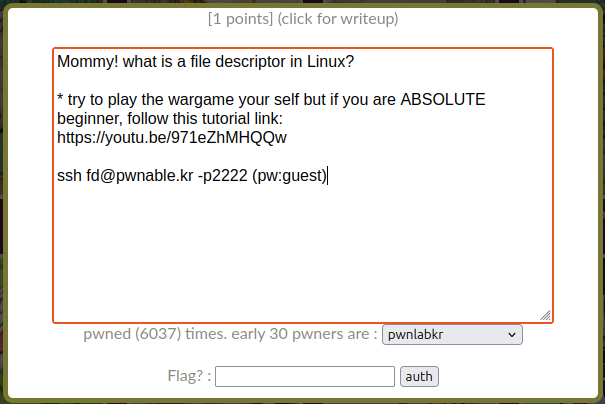

# [fd]



After SSH-ing into the system, I ran `ls -la` to inspect the directory contents in detail.

We can see three important files:

```
-r-xr-sr-x   1 root fd_pwn 15148 Mar 26  2025 fd
-rw-r--r--   1 root root     452 Mar 26  2025 fd.c
-r--r-----   1 root fd_pwn    50 Apr  1  2025 flag
```

The interesting parts here are the permissions and ownerships:

- `fd` is an executable owned by `root`, with the **setgid bit (`s`) set**, meaning it runs with the group permissions of `fd_pwn`
- `fd.c` is readable source code owned by root
- `flag` is readable only by `root` and members of the `fd_pwn` group

Trying to run `cat flag` gives us the expected `cat: flag: Permission denied` error.

Next, we try running the program:

```bash
./fd
```

This prints:
```
pass argv[1] a number
```

and:

```bash
./fd 0
```

prints:
```
learn about Linux file IO
```

At this point, nothing obvious works, so we inspect the source code.

`cat fd.c` reveals the following program:

```c
#include <stdio.h>
#include <stdlib.h>
#include <string.h>

char buf[32];

int main(int argc, char* argv[], char* envp[]){
	if(argc<2){
		printf("pass argv[1] a number\n");
		return 0;
	}

	int fd = atoi(argv[1]) - 0x1234;
	int len = 0;

	len = read(fd, buf, 32);

	if(!strcmp("LETMEWIN\n", buf)){
		printf("good job :)\n");
		setregid(getegid(), getegid());
		system("/bin/cat flag");
		exit(0);
	}

	printf("learn about Linux file IO\n");
	return 0;
}
```

We can see that, if we reach the if-block, we can read the flag file.

After researching Linux IO, we learned that to do that, we need `read(fd, buf, 32)` to read from standard input, and to do that, we need our file descriptor to be 0.

Since:

```
fd = atoi(argv[1]) - 0x1234
```
We need to add 4660 (0x1234 in hex) as a parameter, which should allow us to input something via our terminal.

Now we run:

```bash
./fd 4660
```

Indeed, this is what happened. All we need to do now is to input on our terminal:

```
LETMEWIN
```


This satisfies the condition and executes the if-block, printing the flag and completing the challenge.

---

## What I learned

This challenge showed how file descriptors in Linux are integer references to input/output streams such as stdin and stdout.

By manipulating program arguments, it is possible to control which input source a program reads from.

Additionally, the setgid bit plays an important role in how the binary is executed under a different group context. If that bit was not set, we would still be able to execute the program, but the  `system("/bin/cat flag")` command inside the code would ultimately fail to read the flag file. I assume we would get a similar error to the `cat: flag: Permission denied`.
